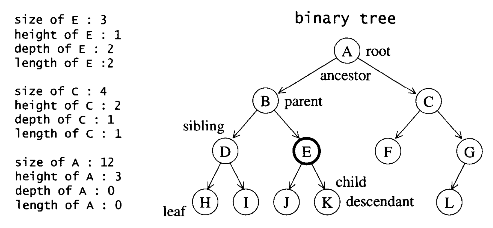
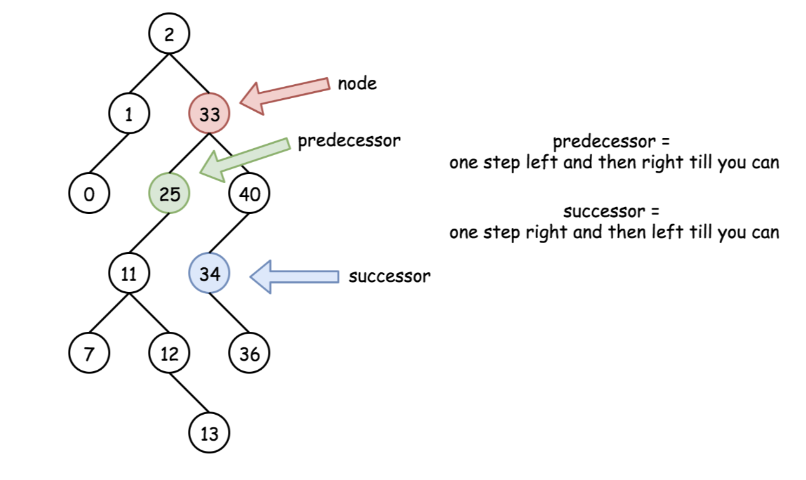

# 树

## 基本



1. 树的高度和深度的区别
    - 深度: 对于任意节点 n, 从**根**到 n 的唯一路径长, 根的深度为 0
    - 高度: 对于任意节点 n, 从 **n** 到叶子的最长路径长, 叶的高度为 0

## 二叉树分类

(定义越来越严格)  

- 平衡二叉树：高度差不超过1 + 搜索树  
- 满二叉树：除叶子节点外，其余节点都有两个子节点  
- 完全二叉树：0 ~ h-1层都是满节点 + h层节点从最左开始，可以不满 -> 因此可以产生堆  
- 完美二叉树：所有层节点都是满的  

## 树的性质

- if root == nil { 一个节点有左右子树, 实际是判断了两棵子树 }
- if root.left == nullptr && root.right == nullptr { 可以锁定一个节点 }
- if root->left && !root->left->left && !root->left->right) // 左叶子

## 二叉搜索树

1. 特性
    1. 中序遍历后的序列是递增排序序列
    2. successor(后继节点): 当前节点的右节点, 然后一直取左节点
    3. predecessor (前驱节点): 当前节点的左节点, 然后一直取右节点
    

## 平衡二叉搜索树

保持整体深度为 O(logN)  
查找/ 增加/ 删除 效率 O(logN)

- AVL树
  - 遵循左右子树高度差为 1
- 红黑树
  - 根据红黑的一定规则
- 对比 红黑树比AVL树的优势？  
  - AVL严格按照平衡二叉树去旋转，可能会导致更多旋转操作；  
  - 红黑树牺牲了一定的平衡性，旋转次数不超过3次的条件下保持一个合理的高度

## 其他树

### B树

1.使用B树作为索引树的原因  
虽然红黑树的查找效率更好，但是由于内存读取的局部性，红黑树节点的实际物理地址离得比较远，导致频繁从磁盘读取，影响速度  
而B树将节点按顺序放在一起，并且起到了索引的作用，减少了向磁盘的读取  

### B+树

1.优点  
1）非叶子节点只存储索引，不存储数据，进而能存储更多的索引  
2）数据都在叶子节点上，并且通过链表相连接，因此可以扫库，通过链表一次读取所有

### LSM 树

1.背景  

- 顺序写磁盘快于随机写至少三个数量级, 因此数据添加到文件, 此时数据可以完全顺序
- 对读友好的方法(二分/哈希/B+树等都以某种结构放置), 导致影响了写效率

2.定义

- 牺牲了部分读性能, 而保证超高写性能 -> 本质是所有操作顺序化
- 修改增量保持在内存(memtable)中, 达到指定限制后将这些修改操作批量写入磁盘(sstable)中

### 前缀树(trie树)

1.优点  

- 相比哈希可以找到同一前缀的全部键值
- 按字典序枚举字符串的数据集

2.实现

```c++
struct TrieNode {
    vector<TrieNode*> layer; // 0 - 26 个字母版本
    unordered_map<char, TrieNode*> layer; // 通用版本
    bool isWord = false;
}
```

# 题目

## 树的性质

### 树的高度/深度

```c
int maxHeight(TreeNode root) {
    if (root == null) return 0;
    int left = GetHeight(root->left);
    int right = GetHeight(root->right);
    return max(left, right) + 1;
}

int minDepth(TreeNode* root) {
    // 因为求最小值, 若其中一个子节点为空, 那么直接回返回 0
    // 所以需要避免这样的情况
    if (root == nullptr) return 0;
    if (root->left == nullptr) return minDepth(root->right) + 1;
    if (root->right == nullptr) return minDepth(root->left) + 1;
    return min(minDepth(root->left), minDepth(root->right)) + 1;
}
```

- 104.二叉树最大深度
- 111.二叉树的最小深度 = 最短路径上的节点数

## 树的操作

### 遍历

```c
// 遍历
void Traversal(TreeNode *root) {
    if (root == nullptr) return;
    // 前序
    Traversal(root->left);
    // 中序
    Traversal(root->right);
    // 后序
}
// 非递归版
void Traversal(TreeNode* root) {
    stack<TreeNode*> treeStack;
    while (root != nullptr || !treeStack.empty()) {
        if (root != nullptr) {
            // 前序
            treeStack.push(root);
            root = root->left;
        }
        else {
            root = treeStack.top();
            // 中序
            treeStack.pop();
            root = root->right;
        }
    }
}
// 非递归版后序 利用双栈实现
void Traversal(TreeNode* root) {
    stack<TreeNode*> treeStack1;
    stack<TreeNode*> treeStack2;

    treeStack1.push(root);
    while (!treeStack1.empty()) {
        root = treeStack1.top();
        treeStack1.pop();

        treeStack2.push(root);
        if (root->left) treeStack1.push(root->left);
        if (root->right) treeStack1.push(root->right);
    }
    // 顺序输出 stack2
}
```

### 改

- 函数加上TreeNode的返回类型
- 701.二叉搜索树中的插入操作

    ```c++
    TreeNode* insertIntoBST(TreeNode* root, int val) {
        if (!root) return new TreeNode(val);
        if (root->val > val) {
            root->left = insertIntoBST(root->left, val);
        } else {
            root->right = insertIntoBST(root->right, val);
        }
        return root;
    }
    ```

- 二叉搜索树种删除节点

### 树转换成链表

- 114.二叉树展开为链表
  - 首先确定遍历顺序: 使用中序遍历
  - 其次进行交换

### 二叉搜索树的数量

- 96.不同的二叉搜索树
  - 卡特兰数 h(n) = h(0)\*h(n-1) + h(1)\*h(n-2) ...
  - dp(2) = dp(0)\*dp(1) + dp(1)\*dp(0)

### 二叉树的路径

重点: 若涉及树的路径, 需要遍历到叶子, 而叶子需要同时判断 left 和 right

- 112.路径总和
- 129.求根到叶子节点数字之和
- 257.二叉树的所有路径

### 二叉搜索树的众数

- 501.二叉搜素树中的众数
